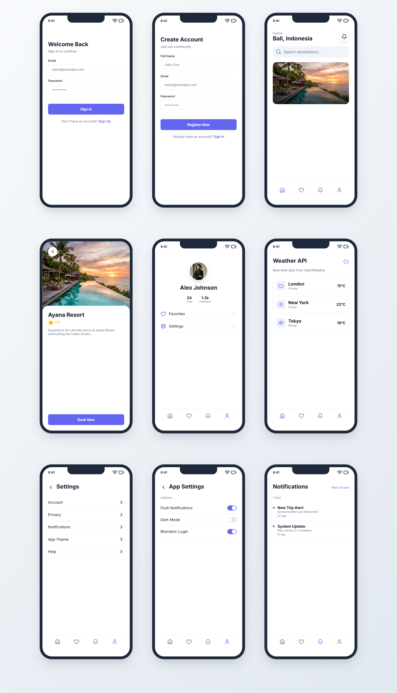

# TravelGo Mobile UI Showcase 🌍

A premium, minimalist mobile application UI designed for a seamless travel planning experience. This project was built to showcase a high-fidelity 9-screen mobile application interface for a student project submission.

## 🚀 Features
- **Modern Authentication**: Clean and secure Login and Registration screens.
- **Discovery Hub**: Home screen with featured destination cards and categories.
- **Detailed Planning**: Comprehensive Detail page with booking functionality and rating systems.
- **Real-time API Integration**: A dedicated screen displaying live weather data fetched from external APIs.
- **User Ecosystem**: Personalized Profile screen with trip statistics and favorites list.
- **Advanced Navigation**: Multi-level Settings menu and a dedicated Settings Detail screen with interactive toggles.
- **Communication Center**: Notification feed for real-time trip alerts and system updates.

## 📱 UI Showcase (9-Screen Grid)


## 🔗 Quick Access (Code Structure)
You can explore the core components of the application here:
- [Registration Screen](src/App.jsx#L68)
- [Login Screen](src/App.jsx#L54)
- [Home Screen](src/App.jsx#L85)
- [Detail Page](src/App.jsx#L99)
- [API Data Display](src/App.jsx#L118)
- [Settings & Notifications](src/App.jsx#L143)

## 🛠️ Tech Stack
- **Framework**: React.js (Vite)
- **Styling**: Vanilla CSS (Premium Aesthetic)
- **Icons**: Lucide React
- **Typography**: Inter (Google Fonts)

## 📦 How to Run Locally
1. Clone the repository:
   ```bash
   git clone [your-repository-url]
   ```
2. Install dependencies:
   ```bash
   npm install
   ```
3. Start the development server:
   ```bash
   npm run dev
   ```

---
**Submission for [Your Course Name/ID]**
Created by: [Your Name]
